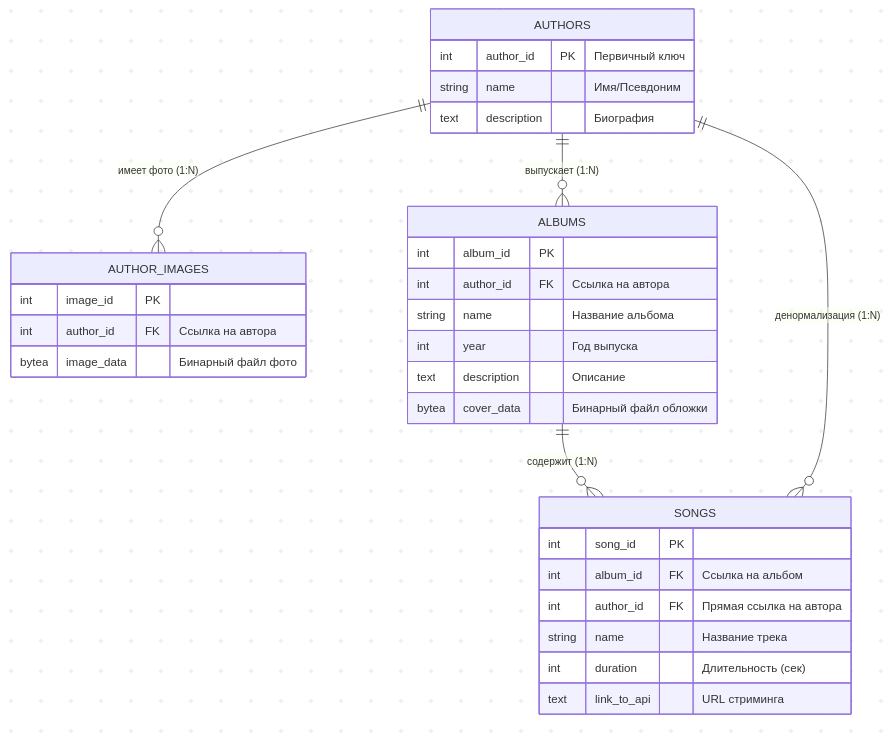

# MediaDMS Database Core. Краткая документация для команды

## Архитектура БД
Система построена на реляционной модели «Автор -> Альбом -> Песня». 
- **Бинарные данные:** Обложки альбомов и фото авторов хранятся в базе в формате `BYTEA`.
- **Оптимизация:** Индексы настроены для быстрого поиска по именам и внешним ключам.
- **Целостность:** Настроено каскадное удаление (`ON DELETE CASCADE`).

## Быстрый старт

1. **Настройка окружения:**
   Убедитесь, что файл `.env` содержит актуальные данные. По умолчанию:
   - Порт: `5531`
   - Пользователь: `admin`, пароль - `access`

2. **Запуск контейнера:**

   ```bash
   docker-compose up -d
   ```

3. **Проверка инициализации:**

    ```bash
    docker exec -it mediadms_postgres psql -U admin -d media_dms_db -c "\dt"
    ```

4. **Пример .env**

    **⚠️ВАЖНО!** docker-compose в этой директории берёт данные для старта именно из .env, обязательно создайте его перед запуском docker-compose.⚠️

    ````.env
    # Database Credentials
    POSTGRES_USER=admin
    POSTGRES_PASSWORD=access
    POSTGRES_DB=media_dms_db

    # Host Configuration
    DB_PORT=5531
    ````

5. **Об изменениях в `.gitignore`**

    В этом коммите создан файл `.gitignore`, в него добавлены все файлы окружения `.env` в проекте из - за соображений безопасности, а также папка `pgdata/`, чтобы не пушить данные базы данных при любом коммите.


## Подключение извне

1. **Необходимые данные**
    - Host: `localhost`
    - Port: `5531` (внешний) / `5432` (внутренний)
    - DB Name: `media_dms_db`

2. **Остановить БД**

```bash
docker-compose stop
```

3. **Очистка БД**

```bash
docker-compose down -v
```

## Mermaid - схема


