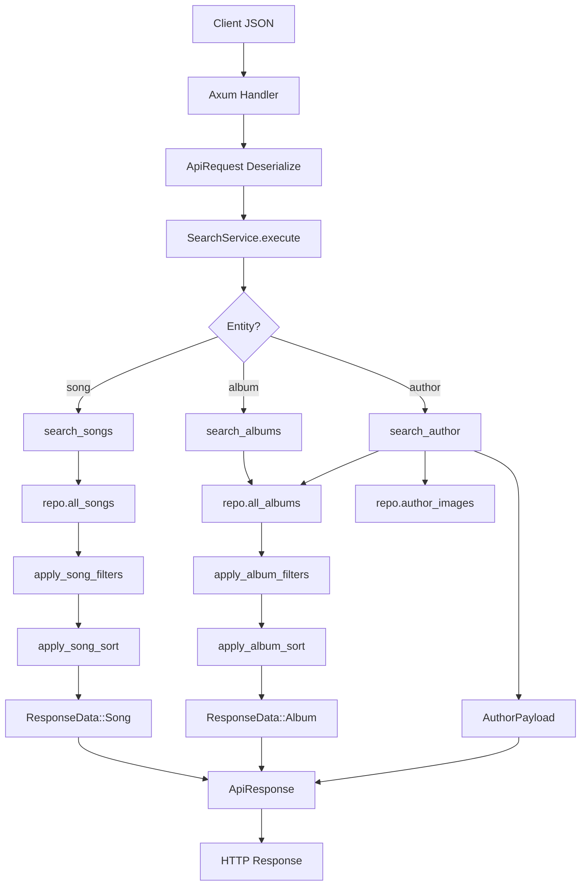
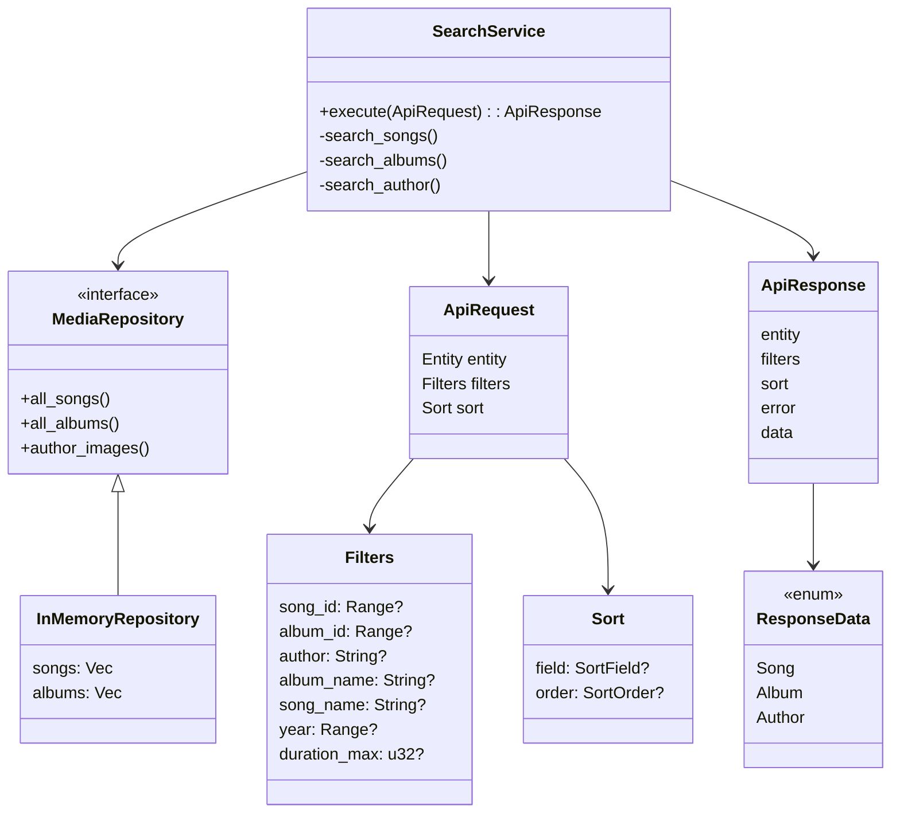

# API backend module (Rust)

## Назначение
Модуль реализует HTTP API для отладки музыкальной БД:
- поиск песен/альбомов;
- получение медиа по автору (альбомы + картинки автора);
- фильтрация и сортировка;
- унифицированные коды ошибок `0..7`;
- логирование запросов (храним последние 5000).

Текущая реализация использует in-memory репозиторий как заглушку вместо PostgreSQL.
После подключения БД достаточно реализовать `MediaRepository`.

## Запуск
```bash
cargo run
```

Сервер стартует на `0.0.0.0:8080`.

## Эндпоинты
- `GET /health`
- `POST /api/v1/query`
- `GET /api/v1/logs`

## Формат запроса
```json
{
  "entity": "song|album|author",
  "filters": {
    "song_id": { "min": 10, "max": 72 },
    "album_id": null,
    "author": "Linkin Park",
    "album_name": null,
    "song_name": null,
    "year": { "min": 2000, "max": 2010 },
    "duration_max": 300
  },
  "sort": {
    "field": "year|song_name|album_name|author|null",
    "order": "asc|desc|null"
  }
}
```

## Формат ответа
```json
{
  "entity": "song",
  "filters": { "...": "echo request filters" },
  "sort": { "...": "echo request sort" },
  "error": 0,
  "error_message": null,
  "data": {
    "entity": "song",
    "items": [
      {
        "song_id": 25,
        "author": "Linkin Park",
        "album_name": "Minutes to Midnight",
        "song_name": "Given Up",
        "year": 2007,
        "duration_sec": 189
      }
    ]
  }
}
```

При ошибке:
- `error != 0`
- `error_message` содержит описание
- `data = null`

## Коды ошибок
- `0` — нет ошибки
- `1` — ошибка подключения к БД
- `2` — запись не найдена
- `3` — ошибка запроса на стороне сервера (построение/выполнение query)
- `4` — некорректный запрос от клиента
- `5` — ошибка формирования ответа
- `6` — ошибка получения данных от БД
- `7` — неизвестная ошибка

## Поведение по entity
### entity = `song`
Поддерживаемые фильтры:
- `song_id` (range)
- `author`
- `album_name`
- `song_name`
- `year` (range)
- `duration_max`

Поддерживаемая сортировка:
- `year`
- `song_name`
- `album_name`
- `author`

### entity = `album`
Поддерживаемые фильтры:
- `album_id` (range)
- `author`
- `album_name`
- `year` (range)

Поддерживаемая сортировка:
- `year`
- `album_name`
- `author`

### entity = `author`
Возвращает:
- все альбомы автора (название, описание, обложка)
- до 6 картинок автора

Требование:
- `filters.author` должен быть заполнен
- `sort.field/order` должны быть `null`

## Примеры запросов
### 1) Песни Linkin Park, id 10..72, 2000..2010, длительность <=300, сортировка по году убыв.
```json
{
  "entity": "song",
  "filters": {
    "song_id": { "min": 10, "max": 72 },
    "album_id": null,
    "author": "Linkin Park",
    "album_name": null,
    "song_name": null,
    "year": { "min": 2000, "max": 2010 },
    "duration_max": 300
  },
  "sort": {
    "field": "year",
    "order": "desc"
  }
}
```

### 2) Все альбомы автора Pelmen без сортировки
```json
{
  "entity": "album",
  "filters": {
    "song_id": null,
    "album_id": null,
    "author": "Pelmen",
    "album_name": null,
    "song_name": null,
    "year": null,
    "duration_max": null
  },
  "sort": {
    "field": null,
    "order": null
  }
}
```

### 3) Песни автора Popugay из альбома Jungle, сортировка по имени asc
```json
{
  "entity": "song",
  "filters": {
    "song_id": null,
    "album_id": null,
    "author": "Popugay",
    "album_name": "Jungle",
    "song_name": null,
    "year": null,
    "duration_max": null
  },
  "sort": {
    "field": "song_name",
    "order": "asc"
  }
}
```

### 4) Медиа автора
```json
{
  "entity": "author",
  "filters": {
    "song_id": null,
    "album_id": null,
    "author": "Linkin Park",
    "album_name": null,
    "song_name": null,
    "year": null,
    "duration_max": null
  },
  "sort": {
    "field": null,
    "order": null
  }
}
```

## Логирование
`GET /api/v1/logs` возвращает массив записей:
- `timestamp_utc`
- `ip`
- `entity`
- `error`
- `error_message`

В памяти хранится максимум 5000 записей. При переполнении удаляется самая старая.

## Интеграция с PostgreSQL (следующий шаг)
1. Добавить реализацию `MediaRepository` через `sqlx`/`tokio-postgres`.
2. Пробрасывать ошибки драйвера в `RepoError`.
3. Оставить контракт `ApiRequest/ApiResponse` без изменений для совместимости клиента.
4. Добавить миграции и интеграционные тесты.

## Схемы работы

Общая картина



Структура



Можете запихнуть код куда-нибудь в mermaid-live и глянуть